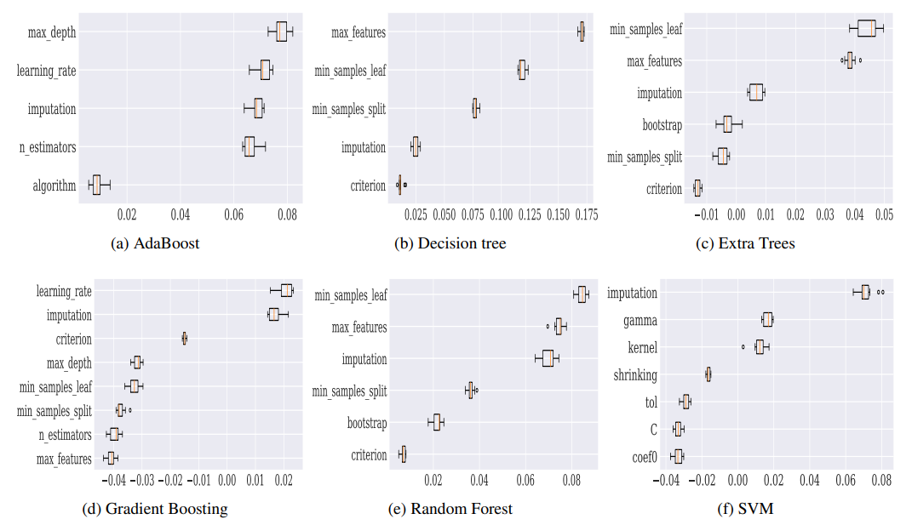
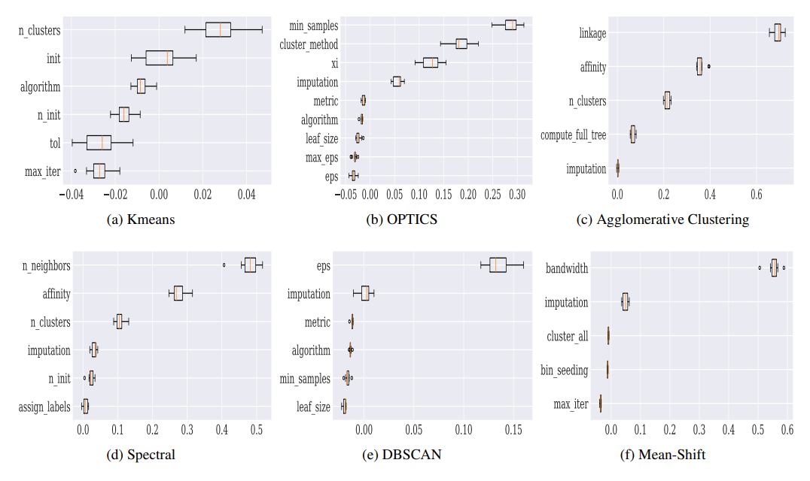

# HPI( hyperparameter importance)
To tune or not to tune? An Approach for Recommending Important Hyperparameters for Classification and Clustering.

You can find everything you need to reproduce the paper's results in this repository. (In the image below, you can only see one of the plot on the paper! All others can be found in subfolders of the repository and recreated by following the structure.)

   Verification of Hyperparameter importance by using of permutation importance method.

## How to install
There are two main repository for this paper:
1. chpi:                       [HPI for six clustering algorithms](https://github.com/DataSystemsGroupUT/chpi)
2. hyperparameter_tunability:  [HPI  for six classification algorithms](https://github.com/DataSystemsGroupUT/HyperParameterTunability)

Check the hyperparameter tunability repository first in order to reproduce the classification section of the paper, then do the same for clustering in the chpi repository.